### Laboratorio WebSokets
### David Santiago Castro Sierra
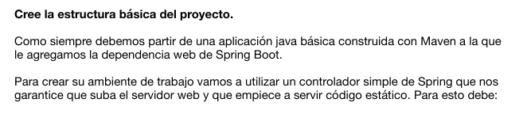

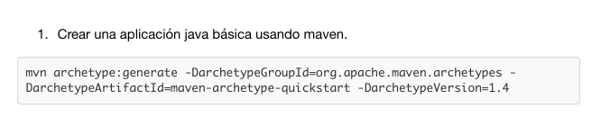

En donde creamos el proyecto, con la siguiente estructura:

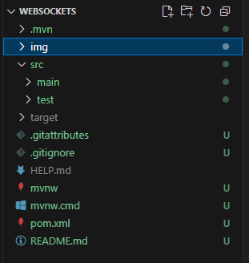

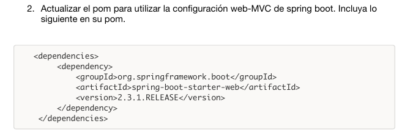

Actualizamos el pom añadiendo la nueva depedencia:

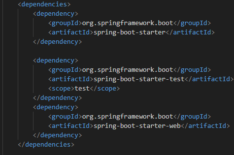

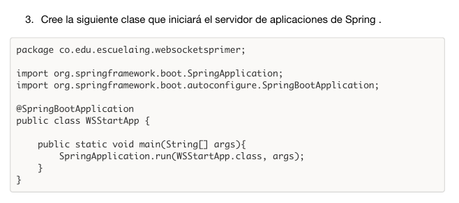

En donde cree la siguiente clase:

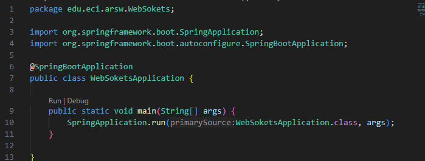

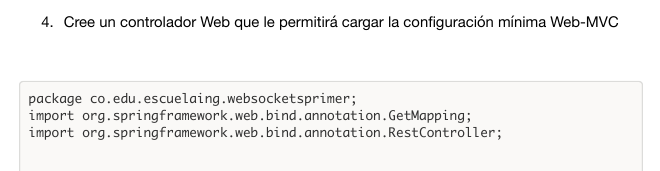
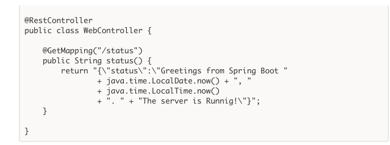

Creando el siguiente controlador:

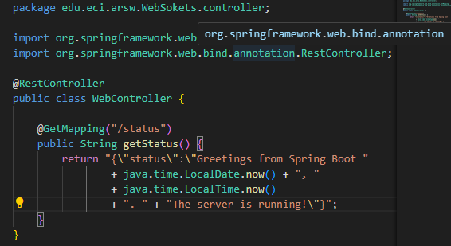

De modo que se creo:

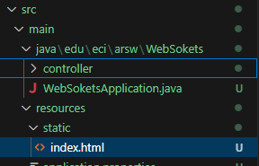

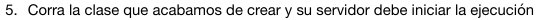

En donde vemos que esta corriendo bien:

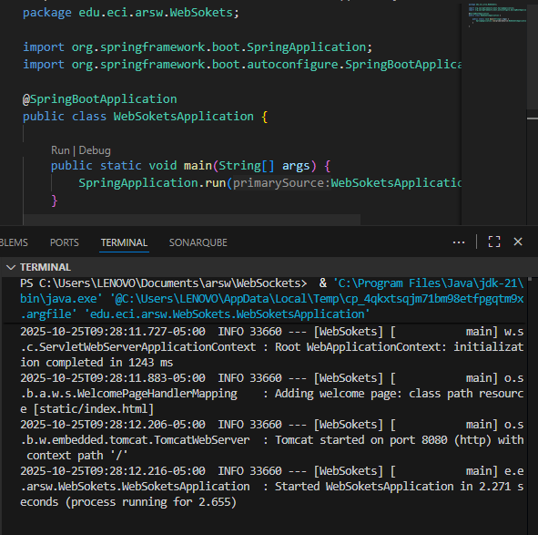

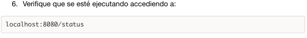

Y efectivamente veremos el correcto funcionamiento de su ejecución:

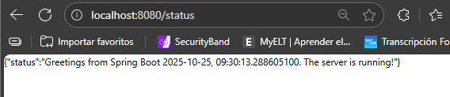

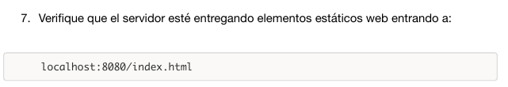

En donde anexamos al html un try catch que intente obtener el estado y lo muestre, si no lo hace, que nos muestre el error de lo que paso:

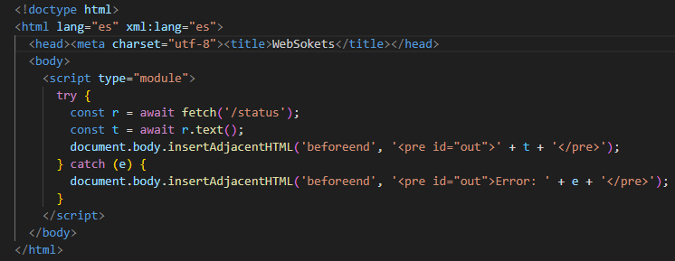

Con esto, veremos que el servidos nos entregara los elemntos estaticos web

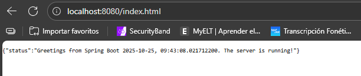

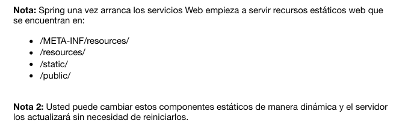

Sobre la nota 1, ya index.html se encuentra en la ruta src/main/resources/static

Para la nota 2, agrgamos la siguiente dependencia en el pom:

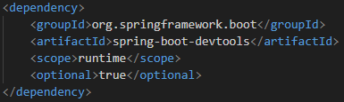

Y en aplicacion properties ponemos que no se guarde el cache, de forma que al volver a ejecutar nuestro proyecto, ya nos permite actualizar el index.html solo guardandolo y recargando el navegador sin necesidad de re ejecutar todo el proyecto

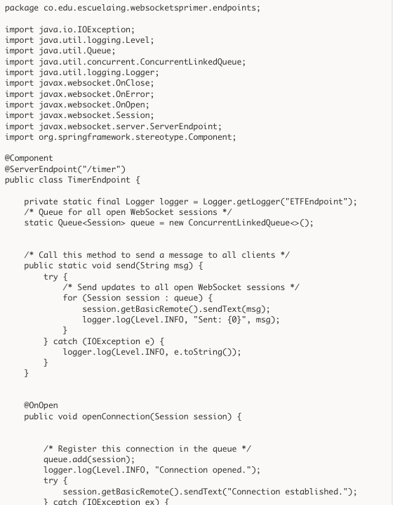
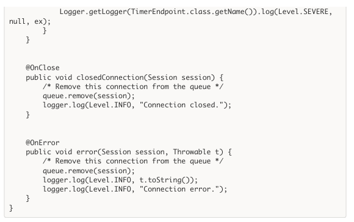

En donde se realizo el siguiente Endpoint:

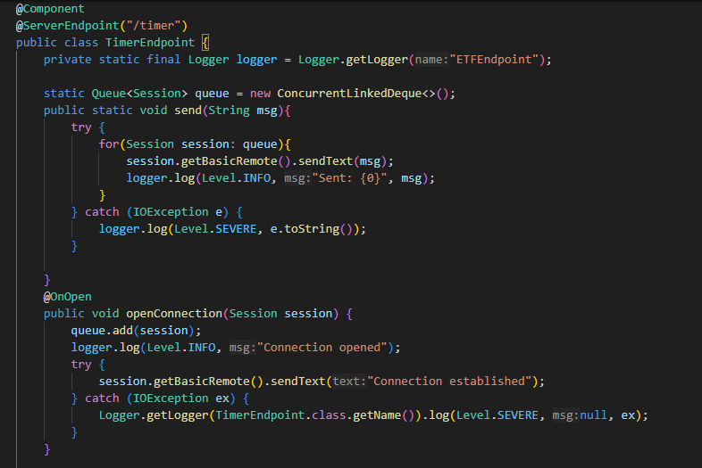

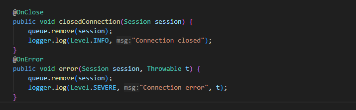
